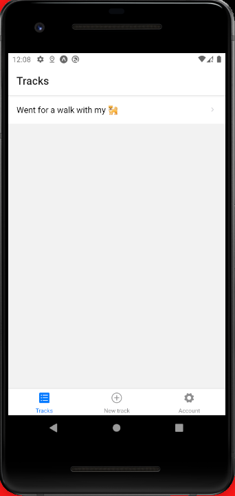

# Tracking app (mobile)

Mobile app to track a user hikes. Built using React Native (expo) during a course.
Check [Tracker Backend](https://github.com/dzvid/tracker-backend) for the backend built using Node and MongoDB.

<div align="center">
  
</div>

PS: for the production build remove the mocked location method.

## Running the project

To run the project it is also necessary to execute the backend.

```sh
1 - Install dependencies, run:

yarn

2 - Execute metro bundler, run:

yarn start

Then, follow the instructions provided by expo to run the app on smartphone/emulator.
```
